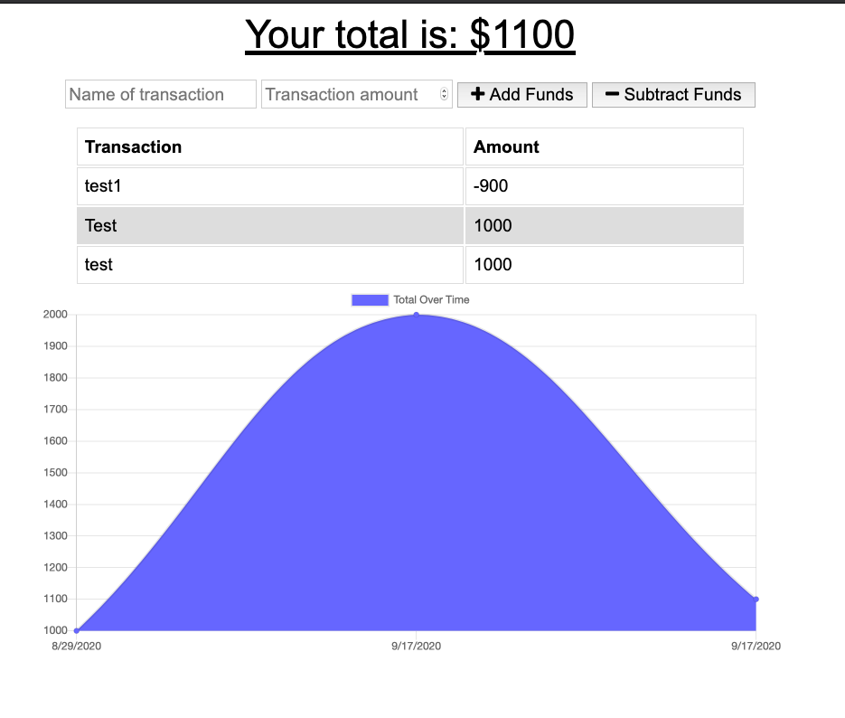

# Online/Offline Budget Trackers

Budget Tracker app helps user to add expenses and deposits to their budget with or without a connection. When entering transactions offline, they should populate the total when brought back online.

## Technology Used
* Node.js
* Express
* MongoDB
* indexedDB
* MongoDB-Atlas

## Images
</a>

## Link to the application deployed in Heroku
<a href = "https://desolate-lake-29810.herokuapp.com/" target ="_blank">Please click here to see the deployed application</a>

